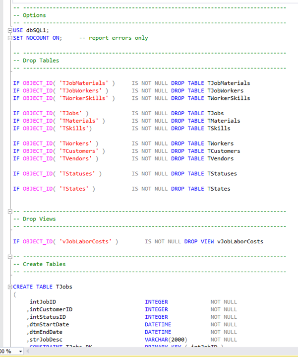
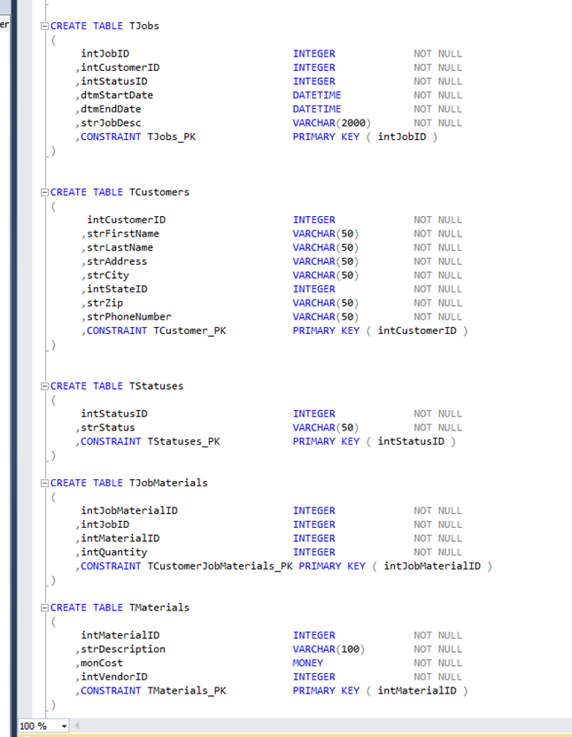
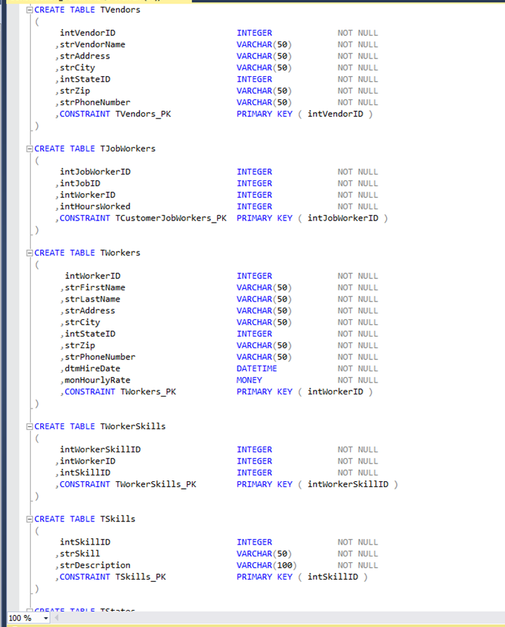
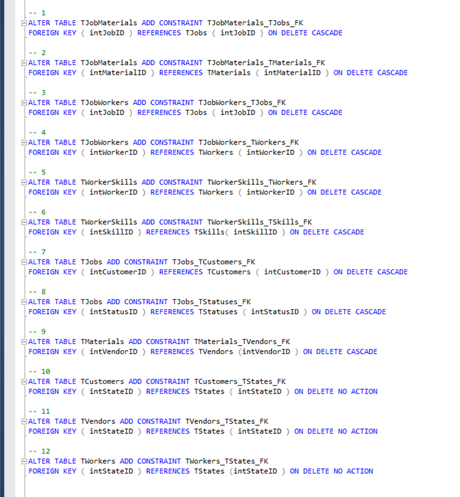

# Construction Company Database  
[Live Video Demo]()

---

## Description
This database is designed to keep records for a construction company  
to help maintain orderly, productive flow of business.  
This is a relational database that practices normalization.  
It was scripted using Microsoft SQL Server.  
There are queries that are included to test the relationships between data  
as well as process the data.    
 

## Tables in Database
__Drop tables screenshot:__  
  
 

__Create tables screenshot:__  
 
 

__Create tables screenshot:__  
 
 
 

## Foreign Key Constraints
__Foreign key constraints screenshot:__  
 
 
 

## Queries
There are 17 queries I wrote to process the data.  
All of these queries will be shown in the Live Video Demo.  
Otherwise they are included in the SQL script in this repository.
 
 

## Live Video Demo  
Click [here]() for a live demonstration of the database.  
 

## Conclusion  
This application was created as a final project for my Microsoft SQL Server course in college.    
I hope you got a chance to check out the live video demonstration in the links provided.  
The script for the project is included in this repository.  
Thank you for your time!
